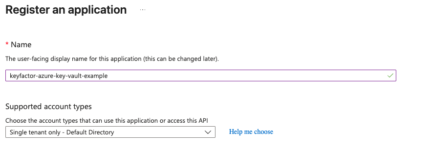
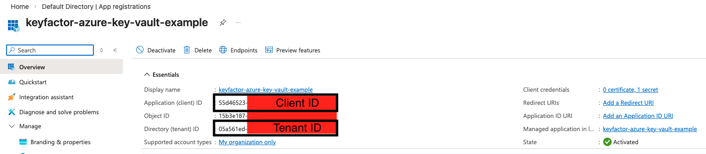
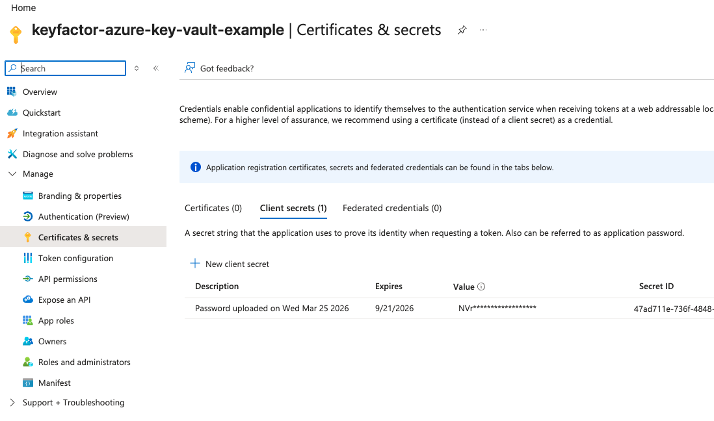
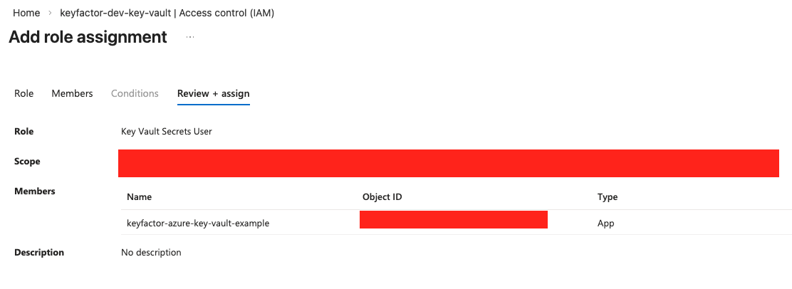
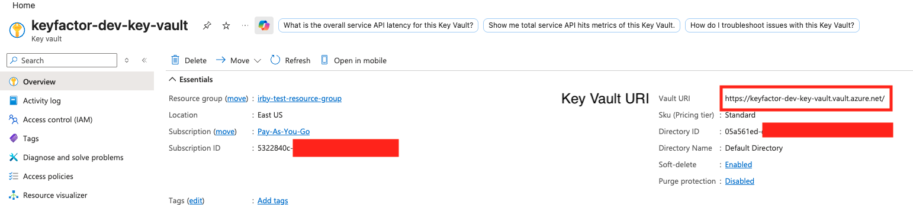
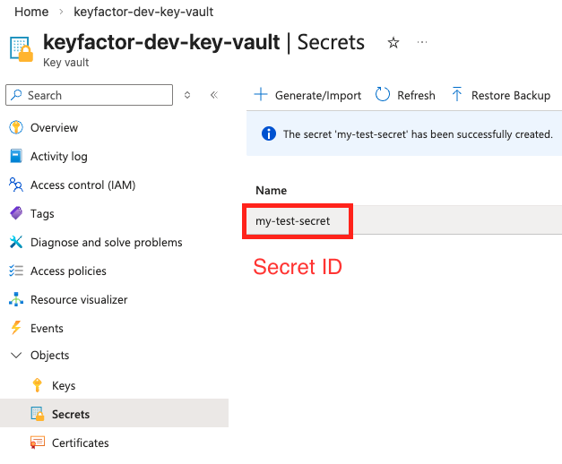
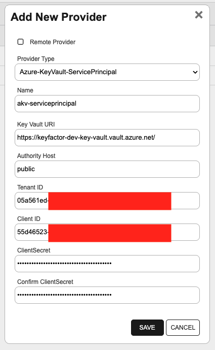
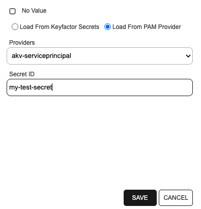

<h1 align="center" style="border-bottom: none">
    Azure Key Vault PAM Provider
</h1>

<p align="center">
  <!-- Badges -->

<a href="https://github.com/Keyfactor/Azure Key Vault PAM Provider/releases"></a>


</p>

<p align="center">
  <a href="#support"><b>Support</b></a> ·
  <a href="#getting-started"><b>Installation</b></a> ·
  <a href="#license"><b>License</b></a> ·
  <a href="https://github.com/orgs/Keyfactor/repositories?q=pam"><b>Related Integrations</b></a>
</p>

## Overview

The Azure Key Vault PAM Provider uses the Azure Key Vault SDK to communicate with a Key Vault in Azure. The provider is able to communicate with Azure Public Cloud, Government, and China. Alternatively, if you have a self-hosted Key Vault compatible with Key Vault's APIs, the provider should be able to communicate with the Key Vault.
Communication with Azure Key Vault is supported via assuming a role on your machine, by reading credentials in environment variables, or by using service principal credentials in your PAM extension configuration.

This PAM Provider supports retrieving all fields available in Azure Key Vault, such as usernames and passwords. It can be installed on either the Keyfactor Command Platform or on Universal Orchestrators.

## Azure KeyVault vs Azure KeyVault ServicePrincipal

There are two Azure Key Vault PAM Providers available: `Azure-KeyVault` and `Azure-KeyVault-ServicePrincipal`.

Here's a matrix explaining the differences between the two extensions:

| PAM Type | Recommended Use Case | manifest.json Configuration | 
|--|--|--|
| Azure-KeyVault | Recommended if Orchestrator or machine can assume an Azure role with a managed identity or read credentials from environment variables to authenticate with Azure Key Vault. [How to setup managed identity access to KeyVault](https://learn.microsoft.com/en-us/azure/key-vault/general/authentication) | - |
| Azure-KeyVault-ServicePrincipal | Recommended if you want to directly specify service principal credentials in your PAM provider configuration to authenticate with Azure Key Vault. Useful if Orchestrator or machine cannot assume an Azure role with managed identity or have ability to modify environment variables. [How to create an Azure service principal](https://learn.microsoft.com/en-us/entra/identity-platform/app-objects-and-service-principals?tabs=browser) | Replace `manifest.json` with contents of `ServicePrincipal-manifest.json` |

## Environment Variable Configuration

Both PAM providers support authenticating with Azure Key Vault via environment variables. If the appropriate environment variables are configured, the PAM provider will read credentials from the environment variables to authenticate with Azure Key Vault. Environment variables will take precedence over the initialization parameters (i.e. `Azure-KeyVault-ServicePrincipal`). The supported environment variables for both extensions are:

| Environment Variable | Description |
|--|--|
| AZURE_CLIENT_ID | The application (client) ID of an Azure AD application. |
| AZURE_TENANT_ID | The tenant (directory) ID in Azure the Azure Key Vault belongs to. |
| AZURE_CLIENT_SECRET | The client secret for the Azure AD application. |
| AZURE_AUTHORITY_HOST | The authority host to authenticate against. For most use cases, this will simply be `public`. Please refer to the [Authority Hosts](#authority-hosts) section for more information on this parameter. |

## Authority Hosts

The Azure Key Vault PAM provider requires an **Authority Host** to be defined. The **Authority Host** is the endpoint with which Azure will authenticate against. There are predefined Azure Authority Hosts the PAM Provider library will resolve to. The value and resolved Authority Host can be found below:

|Value|Authority Host|
|--|--|
|china|Azure China|
|government|Azure Government|
|public|Azure Public Cloud|

For most use cases, `public` will be an acceptable **Authority Host** value for your PAM provider. You may also provide a custom authority host not defined in the table above, but the authority host ***must*** begin with `https://`, for example `https://custom.microsoftonline.com`.

Authority Hosts may also be specified via the `AZURE_AUTHORITY_HOST` environment variable. If this environment variable is configured, it will override the value supplied to the PAM provider.

For more information on Azure authority hosts, please review [the Azure SDK documentation](https://learn.microsoft.com/en-us/dotnet/api/azure.identity.azureauthorityhosts?view=azure-dotnet#properties).

## Example Setup of Azure Key Vault PAM Provider

This example shows setting up a service principal access to an Azure Key Vault. This example only covers using [RBAC / Access Control (IAM)](https://learn.microsoft.com/en-us/azure/key-vault/general/rbac-guide?tabs=azure-cli), but you can also use [Access Policies](https://learn.microsoft.com/en-us/azure/key-vault/general/assign-access-policy?tabs=azure-portal) to configure access to your Key Vault.

First, within Entra ID, create a service principal by creating an app registration. Once the app registration is created, create a client secret for the app registration and note the client secret value, application (client) ID, and tenant ID.




Navigate to **Certificates & Secrets** and create a new client secret. Note the value of the client secret as it will not be shown again after you navigate away from the page. **Ignore the Secret ID shown on this page as it is not used for PAM provider configuration.**



Now, navigate to your Azure Key Vault instance. Under the **Access Control (IAM)** section, add a new role assignment. You can assign the "Key Vault Secrets User" role, which will allow the service principal to read secrets from the Key Vault. Assign this role to the service principal you created in the previous step.




Note the Key Vault URI from the Key Vault's overview page as you will need it for PAM provider configuration.



Next, add a secret to your Key Vault or use an existing secret. Note the name of the secret as you will need it for PAM provider configuration (Secret ID).



Finally, configure your PAM provider with the appropriate initialization and instance parameters as outlined in the [Initialization and Instance Parameters for Extension](#initialization-and-instance-parameters-for-extension) section. If you are using the `Azure-KeyVault-ServicePrincipal` PAM provider, you can directly input the service principal credentials in the initialization parameters. If you are using the `Azure-KeyVault` PAM provider, you can set the service principal credentials as environment variables on your machine or Orchestrator.




## Support
The Azure Key Vault PAM Provider is supported by Keyfactor for Keyfactor customers. If you have a support issue, please open a support ticket via the Keyfactor Support Portal at https://support.keyfactor.com.

> To report a problem or suggest a new feature, use the **[Issues](../../issues)** tab. If you want to contribute actual bug fixes or proposed enhancements, use the **[Pull requests](../../pulls)** tab.

## Getting Started

The Azure Key Vault PAM Provider is used by Command to resolve PAM-eligible credentials for Universal Orchestrator extensions and for accessing Certificate Authorities.

### Installation

The Azure Key Vault PAM Provider implements 2 PAM Types:
* [Azure-KeyVault](docs/azure-keyvault.md)
* [Azure-KeyVault-ServicePrincipal](docs/azure-keyvault-serviceprincipal.md)

<details><summary>Azure-KeyVault</summary>

#### Requirements

The Azure Key Vault PAM extension requires a Key Vault hosted in Azure (Public / Government / China) or a Key Vault hosted with Azure Key Vault-compatible APIs. To access your Key Vault, permissions will need to be configured to allow your machine to the Key Vault (details found below).

An Azure Key Vault can be easily created and configured within Azure (documentation for how to create a key vault in the Azure Portal can be found [here](https://learn.microsoft.com/en-us/azure/key-vault/general/quick-create-portal)). Each Azure Key Vault will have its own unique endpoint (Vault URI) which is visible from the key vault's _Overview_ section. 

New secrets can be added to your Azure Key Vault under the key vault's _Secrets_ section. Documentation on how to create a secret in Azure Portal can be found [here](https://learn.microsoft.com/en-us/azure/key-vault/secrets/quick-create-portal#add-a-secret-to-key-vault).

You can either use Role-Based Access Control (RBAC) or Access Policies to manage access to your Key Vault secrets. Documentation on access policies for secrets can be found [here](https://learn.microsoft.com/en-us/azure/key-vault/secrets/about-secrets#secret-access-control) while documentation on RBAC access to secrets can be found [here](https://learn.microsoft.com/en-us/azure/key-vault/general/rbac-guide).

If your app is hosted in Azure, follow [this guide](https://learn.microsoft.com/en-us/dotnet/azure/sdk/authentication/azure-hosted-apps) on how to authenticate your application with your Azure resources.

If your app is ***not hosted*** in Azure, you can follow [this guide](https://learn.microsoft.com/en-us/dotnet/azure/sdk/authentication/on-premises-apps) on how to authenticate your non-Azure / on-premise application with your Azure resources.

### Initialization and Instance Parameters for Extension

__Initialization Parameters for each defined PAM Provider instance__
| Initialization parameter | Display Name | Description |
| :---: | :---: | --- |
| KeyVaultUri | Azure Key Vault URI | The unique auto generated URI for your Azure KeyVault. |
| AuthorityHost | Authority Host | The authority host to authenticate against. For most use cases, this will simply be `public`. Please refer to the **Authority Hosts** section for more information on this parameter. If `AZURE_AUTHORITY_HOST` is a defined environment variable, it will override this value. |

__Instance Parameters for each retrieved secret field__
| Instance parameter | Display Name | Description |
| :---: | :---: | --- |
| SecretId | Secret Name | The name of the secret you assigned in Azure Key Vault. |

#### Create PAM type in Keyfactor Command

##### Using `kfutil`
```shell
# Azure-KeyVault
kfutil pam types-create -r Azure Key Vault PAM Provider -n Azure-KeyVault
```

##### Using the API
```json
{
  "Name": "Azure-KeyVault",
  "Parameters": [
    {
      "Name": "KeyVaultUri",
      "DisplayName": "Key Vault URI",
      "DataType": 1,
      "InstanceLevel": false,
      "Description": "URI for your Azure Key Vault"
    },
    {
      "Name": "AuthorityHost",
      "DisplayName": "Authority Host",
      "DataType": 1,
      "InstanceLevel": false,
      "Description": "Authority host of your Azure infrastructure"
    },
    {
      "Name": "SecretId",
      "DisplayName": "Secret ID",
      "DataType": 1,
      "InstanceLevel": true,
      "Description": "Name of your secret in Azure Key Vault"
    }
  ]
}
```

#### Install PAM provider on Keyfactor Command Host (Local)

The entire contents (which includes all library dependencies) should be copied when installing. Refer to the [Keyfactor Command documentation](https://software.keyfactor.com/Core-OnPrem/v24.4.1/Content/ReferenceGuide/Preparing%20Third%20Party%20PAM%20Providers%20to%20Work%20with.htm) on how to install your extension. Modify your `manifest.json`, updating the `InitializationInfo` section with the appropriate values.

#### Install PAM provider on a Universal Orchestrator Host (Remote)

The entire contents (which includes all library dependencies) should be copied when installing. Refer to the [Keyfactor Command documentation](https://software.keyfactor.com/Core-OnPrem/v24.4.1/Content/ReferenceGuide/Preparing%20Third%20Party%20PAM%20Providers%20to%20Work%20with.htm) on how to install your extension.

</details>

<details><summary>Azure-KeyVault-ServicePrincipal</summary>

#### Requirements

The Azure Key Vault PAM extension requires a Key Vault hosted in Azure (Public / Government / China) or a Key Vault hosted with Azure Key Vault-compatible APIs. To access your Key Vault, permissions will need to be configured to allow your machine to the Key Vault (details found below).

An Azure Key Vault can be easily created and configured within Azure (documentation for how to create a key vault in the Azure Portal can be found [here](https://learn.microsoft.com/en-us/azure/key-vault/general/quick-create-portal)). Each Azure Key Vault will have its own unique endpoint (Vault URI) which is visible from the key vault's _Overview_ section. 

New secrets can be added to your Azure Key Vault under the key vault's _Secrets_ section. Documentation on how to create a secret in Azure Portal can be found [here](https://learn.microsoft.com/en-us/azure/key-vault/secrets/quick-create-portal#add-a-secret-to-key-vault).

You can either use Role-Based Access Control (RBAC) or Access Policies to manage access to your Key Vault secrets. Documentation on access policies for secrets can be found [here](https://learn.microsoft.com/en-us/azure/key-vault/secrets/about-secrets#secret-access-control) while documentation on RBAC access to secrets can be found [here](https://learn.microsoft.com/en-us/azure/key-vault/general/rbac-guide).

If your app is hosted in Azure, follow [this guide](https://learn.microsoft.com/en-us/dotnet/azure/sdk/authentication/azure-hosted-apps) on how to authenticate your application with your Azure resources.

If your app is ***not hosted*** in Azure, you can follow [this guide](https://learn.microsoft.com/en-us/dotnet/azure/sdk/authentication/on-premises-apps) on how to authenticate your non-Azure / on-premise application with your Azure resources.

### Initialization and Instance Parameters for Extension

__Initialization Parameters for each defined PAM Provider instance__
| Initialization parameter | Display Name | Description |
| :---: | :---: | --- |
| KeyVaultUri | Azure Key Vault URI | The unique auto generated URI for your Azure KeyVault. |
| AuthorityHost | Authority Host | The authority host to authenticate against. For most use cases, this will simply be `public`. Please refer to the **Authority Host** section for more information on this parameter. If `AZURE_AUTHORITY_HOST` is a defined environment variable, it will override this value. |
| TenantId | Tenant ID | The tenant (directory) ID in Azure the Azure Key Vault belongs to. If `AZURE_TENANT_ID` is a defined environment variable, it will override this value. |
| ClientId | Client ID | The application ID in Entra AD. If `AZURE_CLIENT_ID` is a defined environment variable, it will override this value. |
| ClientSecret | Client Secret | The client secret for the application ID. If `AZURE_CLIENT_SECRET` is a defined environment variable, it will override this value. |

__Instance Parameters for each retrieved secret field__
| Instance parameter | Display Name | Description |
| :---: | :---: | --- |
| SecretId | Secret Name | The name of the secret you assigned in Azure Key Vault. |

#### Create PAM type in Keyfactor Command

##### Using `kfutil`
```shell
# Azure-KeyVault-ServicePrincipal
kfutil pam types-create -r Azure Key Vault PAM Provider -n Azure-KeyVault-ServicePrincipal
```

##### Using the API
```json
{
  "Name": "Azure-KeyVault-ServicePrincipal",
  "Parameters": [
    {
      "Name": "KeyVaultUri",
      "DisplayName": "Key Vault URI",
      "DataType": 1,
      "InstanceLevel": false,
      "Description": "URI for your Azure Key Vault"
    },
    {
      "Name": "AuthorityHost",
      "DisplayName": "Authority Host",
      "DataType": 1,
      "InstanceLevel": false,
      "Description": "Authority host of your Azure infrastructure"
    },
    {
      "Name": "TenantId",
      "DisplayName": "Tenant ID",
      "DataType": 1,
      "InstanceLevel": false,
      "Description": "Tenant or directory ID in Azure"
    },
    {
      "Name": "ClientId",
      "DisplayName": "Client ID",
      "DataType": 1,
      "InstanceLevel": false,
      "Description": "Application ID in Entra AD"
    },
    {
      "Name": "ClientSecret",
      "DisplayName": "ClientSecret",
      "DataType": 2,
      "InstanceLevel": false,
      "Description": "Client secret for your application ID"
    },
    {
      "Name": "SecretId",
      "DisplayName": "Secret ID",
      "DataType": 1,
      "InstanceLevel": true,
      "Description": "Name of your secret in Azure Key Vault"
    }
  ]
}
```

#### Install PAM provider on Keyfactor Command Host (Local)

The entire contents (which includes all library dependencies) should be copied when installing. Refer to the [Keyfactor Command documentation](https://software.keyfactor.com/Core-OnPrem/v24.4.1/Content/ReferenceGuide/Preparing%20Third%20Party%20PAM%20Providers%20to%20Work%20with.htm) on how to install your extension. Copy the `ServicePrincipal-manifest.json` into your `manifest.json` file, and then update the `InitializationInfo` section with the appropriate values.

#### Install PAM provider on a Universal Orchestrator Host (Remote)

The entire contents (which includes all library dependencies) should be copied when installing. Refer to the [Keyfactor Command documentation](https://software.keyfactor.com/Core-OnPrem/v24.4.1/Content/ReferenceGuide/Preparing%20Third%20Party%20PAM%20Providers%20to%20Work%20with.htm) on how to install your extension. Copy the `ServicePrincipal-manifest.json` into your `manifest.json` file.

</details>

### Usage

<details><summary>Azure-KeyVault</summary>

#### From Keyfactor Command Host (Local)

| Initialization parameter | Display Name | Description |
| --- | --- | --- |
| KeyVaultUri | Key Vault URI | URI for your Azure Key Vault |
| AuthorityHost | Authority Host | Authority host of your Azure infrastructure |

#### From a Universal Orchestrator Host (Remote)

| Instance parameter | Display Name | Description |
| --- | --- | --- |
| SecretId | Secret ID | Name of your secret in Azure Key Vault |

> [!NOTE]
> Additional information on Azure-KeyVault can be found in the [supplemental documentation](docs/azure-keyvault.md).
</details>

<details><summary>Azure-KeyVault-ServicePrincipal</summary>

#### From Keyfactor Command Host (Local)

| Initialization parameter | Display Name | Description |
| --- | --- | --- |
| KeyVaultUri | Key Vault URI | URI for your Azure Key Vault |
| AuthorityHost | Authority Host | Authority host of your Azure infrastructure |
| TenantId | Tenant ID | Tenant or directory ID in Azure |
| ClientId | Client ID | Application ID in Entra AD |
| ClientSecret | ClientSecret | Client secret for your application ID |

#### From a Universal Orchestrator Host (Remote)

| Instance parameter | Display Name | Description |
| --- | --- | --- |
| SecretId | Secret ID | Name of your secret in Azure Key Vault |

> [!NOTE]
> Additional information on Azure-KeyVault-ServicePrincipal can be found in the [supplemental documentation](docs/azure-keyvault-serviceprincipal.md).
</details>

## License

Apache License 2.0, see [LICENSE](LICENSE)

## Related Integrations

See all [Keyfactor PAM Provider extensions](https://github.com/orgs/Keyfactor/repositories?q=pam).
